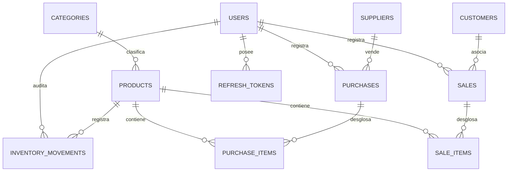

<!-- doc-version: 1.1 | last-updated: 2026-08-20 -->
# Esquema de Base de Datos — Vista Global

## Diagrama Entidad-Relación

## Tabla `refresh_tokens` (módulo auth)
Sesiones de refresh token rotativas (introducida en `V4__Refresh_Tokens.sql`).

| Columna | Tipo | Notas |
|---|---|---|
| id | BIGSERIAL PK | |
| token_hash | VARCHAR(64) UNIQUE | SHA-256 del token opaco (nunca se guarda en claro) |
| user_id | BIGINT | `FK_refresh_tokens_user` → `users(id)` |
| family_id | VARCHAR(36) | Agrupa los tokens rotados de una sesión (revocación en cadena) |
| expires_at | TIMESTAMP | |
| revoked | BOOLEAN | |
| created_at / updated_at | TIMESTAMP | |

## Convenciones
- Motor: PostgreSQL 16 (prod), H2 (dev)
- Normalización: 3FN
- PKs: `id BIGINT AUTO_INCREMENT` (excepto `settings` que usa `id INT = 1`)
- Timestamps: `created_at`, `updated_at` en todas las tablas maestras
- Borrado lógico: campo `active BOOLEAN DEFAULT TRUE`
- Tipos monetarios: `DECIMAL(12,2)`
- Nombres de tablas: snake_case, plural
- FKs: `FK_<tabla>_<referencia>` (ej. `FK_products_category`)
- Índices: `IDX_<tabla>_<campo>` (ej. `IDX_products_barcode`)

## Índices de Rendimiento
| Índice | Tabla.Campo | Propósito |
|---|---|---|
| IDX_products_barcode | products(barcode) | Búsqueda POS con lector |
| IDX_products_internal_code | products(internal_code) | Búsqueda interna |
| IDX_sales_created_at | sales(created_at) | Historial y reportes diarios |
| IDX_movements_product_date | inventory_movements(product_id, created_at) | Kardex de producto |
| IDX_customers_identification | customers(identification) | Asociar cliente en POS |
| IDX_refresh_tokens_user | refresh_tokens(user_id) | Purga y consulta de sesiones por usuario |
| IDX_refresh_tokens_family | refresh_tokens(family_id) | Revocación de sesión completa (reuso) |
| IDX_refresh_tokens_expires | refresh_tokens(expires_at) | Limpieza de tokens caducados |

## Migraciones de Base de Datos (Flyway)

Toda modificación al esquema físico de la base de datos (creación de tablas, alteración de columnas, inserción de datos semilla, creación de índices) **DEBE** gestionarse mediante scripts de migración de Flyway.

- **Ubicación obligatoria**: `src/main/resources/db/migration/`
- **Nomenclatura**: `V<Versión>__<descripción_breve_snake_case>.sql`
  - *Ejemplo*: `V1__init_schema.sql` (creación de tablas base).
  - *Ejemplo*: `V2__add_idx_products_barcode.sql` (creación de índice).
- **Inmutabilidad**: Una vez que una migración ha sido mezclada en la rama principal y ejecutada, **NUNCA** debe ser modificada. Cualquier corrección debe realizarse en una nueva versión de migración (ej. `V3__...`).
- **Validación**: Hibernate está configurado con `ddl-auto=validate`, por lo que cualquier discrepancia entre las entidades JPA de Java y el esquema migrado por Flyway provocará un fallo de compilación/arranque de la aplicación.

Nota: El DDL detallado de cada tabla está en el `spec.md` del módulo correspondiente.

